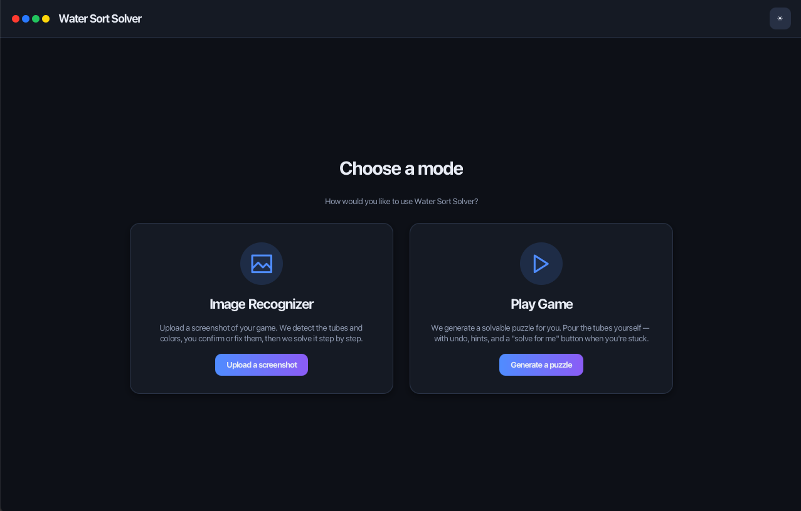
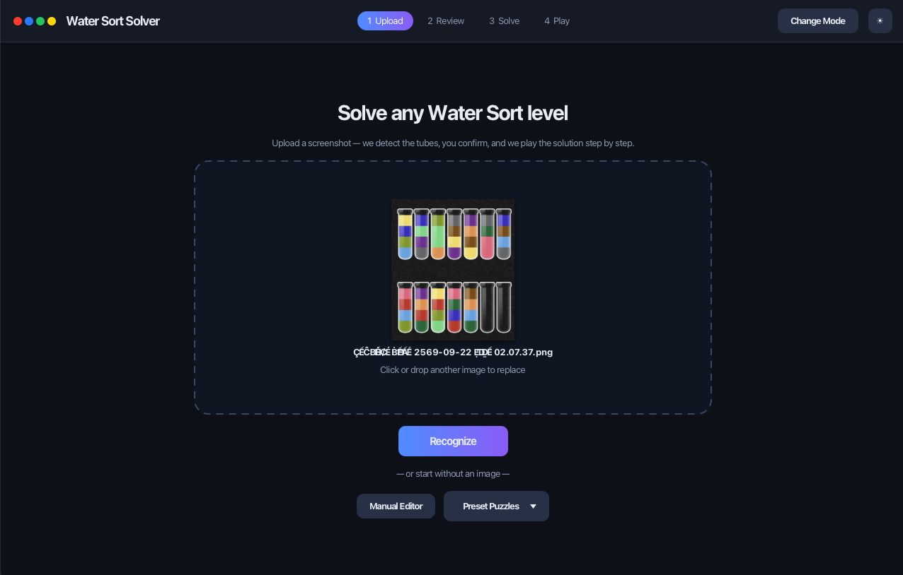
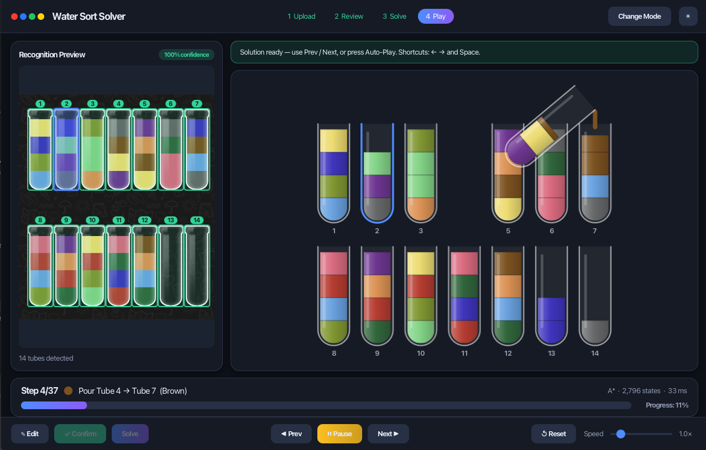
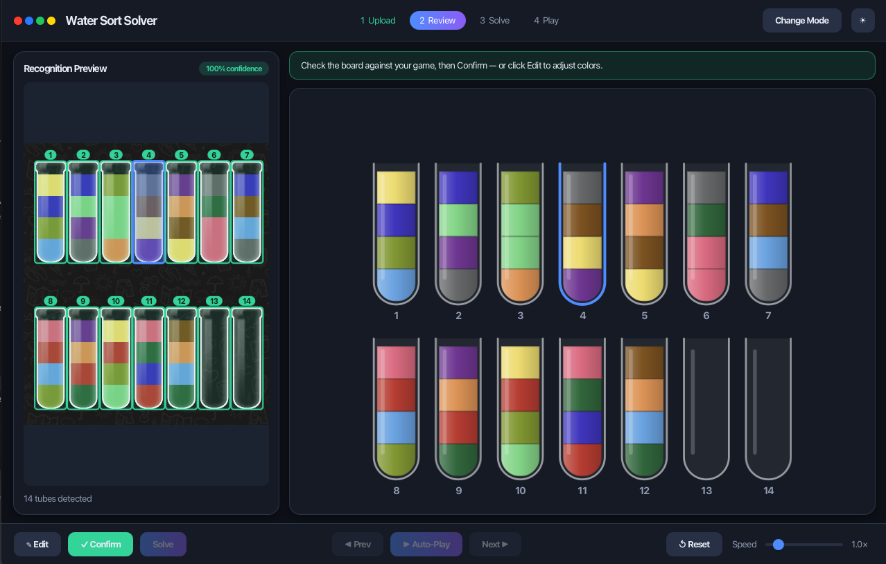
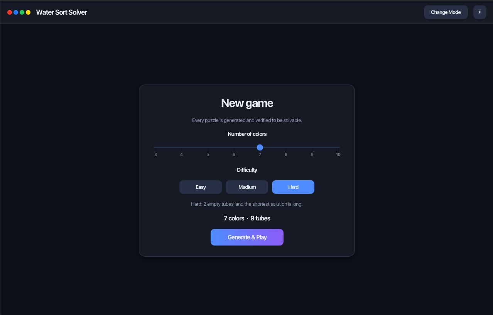
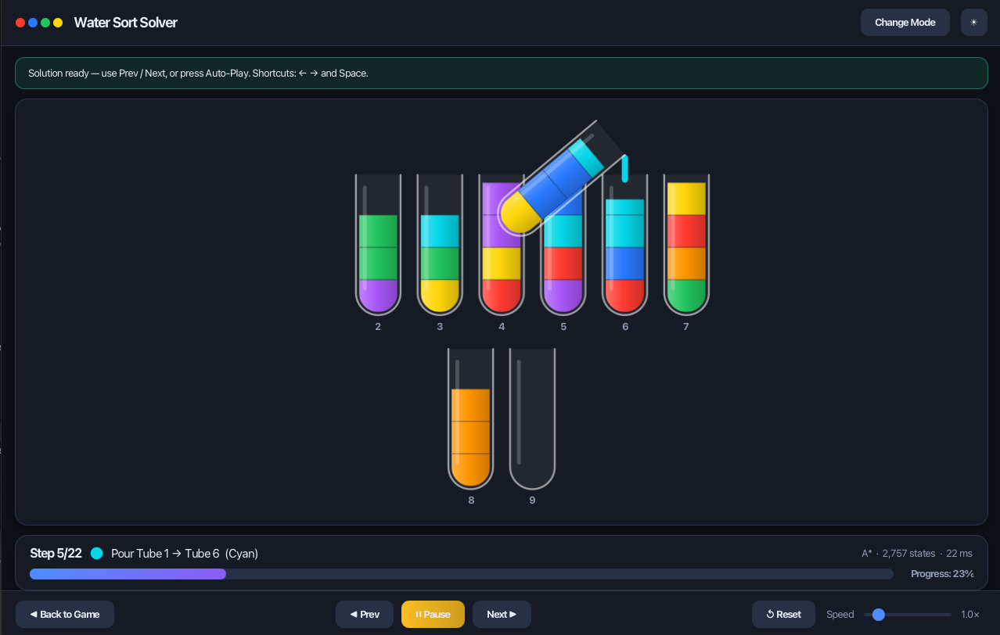

# 🧪 Water Sort Puzzle — Auto-Solver & Game Engine

> A comprehensive toolset for Water Sort Puzzle (Screenshot → Auto-Detect → Solve → Step-by-Step Animation) 
> coupled with a built-in Game Engine that lets you generate and play your own puzzles!

[](https://openjdk.org/)
[](LICENSE)

---

## 📌 Overview

**Water Sort Puzzle Auto-Solver** is not just a game solver — it is a **comprehensive toolset**.
Users simply upload a game screenshot → the system automatically detects tubes and extracts colors
→ calculates the shortest path solution → and displays it as a step-by-step animation.

### Problems Solved

| Problem | Solution |
|---|---|
| **Stuck State** | The program searches all possible paths. If a solution exists, it will find it. |
| **Infinite Loop** | Uses State Caching (`HashSet` in BFS / `HashMap` gScore in A*) to remember visited states and prevent backtracking. |
| **Shortest Path (Optimization)** | BFS guarantees the shortest path / A* speeds up the search with a heuristic. |

---

## 🎯 Features

### Core — Solver & CLI
- [x] Game Rules & Specification ([SPEC.md](SPEC.md))
- [x] Data Model (`Tube`, `BoardState`, `Move`)
- [x] BFS Solver + A* Solver (heuristic `max(h1, h2)`, optimal)
- [x] State Caching & Loop Detection
- [x] CLI: interactive, `--demo`, `--file` (JSON), `--image`, `--generate`, `--batch`
- [x] Puzzle Generator (Randomizes puzzles + verifies solvability with A*, 3 difficulty levels)
- [x] Unit Tests (JUnit 5) + JaCoCo coverage

### Image Recognition Pipeline ★
- [x] 📸 Reads game screenshots (PNG/JPG)
- [x] 🔍 Detects & crops tubes from the image (OpenCV / Classical CV)
- [x] 🎨 Extracts color per slot (LAB space) + groups colors using constrained clustering + assigns readable color names
- [x] ✅ Auto-generates `BoardState` + Validation (requires 4 blocks per color, ≥ 2 empty tubes)
- [x] 👤 User Preview & Confirmation before solving
- [ ] Vision API fallback (optional)

### Desktop GUI (JavaFX) — 2 Modes
- [x] 🧭 Mode Selection: **Image Recognizer** / **Play Game**
- [x] 📸 Drag & Drop screenshot upload
- [x] 🔍 Recognition Preview (Highlights tubes on the original image) + visualizes actual extracted colors
- [x] 🎨 Board Editor — Manually correct any misrecognized colors
- [x] ▶️ Solve → Step-by-step pour animation, ⏮️⏭️ Step Navigator, adjustable Auto-Play speed
- [x] 🎮 Play Game — Auto-generates puzzles for you to play + Undo / Restart / Hint / Solve for me
- [x] 🌓 Dark theme (default) / Light theme
- [ ] Save/Load puzzle state
- [ ] Web UI (optional)

---

## 🏗️ Project Structure

```
water-sort-puzzle/
├── README.md                   # Project overview
├── SPEC.md                     # Game Specification & Rules
├── PLAN.md                     # Implementation Plan & Roadmap
├── build.gradle.kts            # Gradle (JavaFX plugin, OpenCV/JavaCV, JUnit 5, JaCoCo)
├── LICENSE
│
├── src/main/java/watersort/
│   ├── Main.java               # CLI entry point
│   ├── model/                  # Data structures
│   │   ├── Tube.java · BoardState.java · Move.java
│   ├── solver/                 # Search algorithms
│   │   ├── Solver.java (interface) · SolveResult.java
│   │   └── BFSSolver.java · AStarSolver.java
│   ├── generator/              # Puzzle Generator
│   │   └── PuzzleGenerator.java · GeneratedPuzzle.java
│   ├── vision/                 # ★ Image Recognition Pipeline
│   │   ├── TubeDetector.java      (detects tubes)
│   │   ├── ColorExtractor.java    (LAB/HSV/RGB per slot)
│   │   ├── ColorNamer.java        (assigns readable names)
│   │   ├── ColorPalette.java      (HSV lookup — reference)
│   │   ├── ImageRecognizer.java   (orchestrator + clustering + validation)
│   │   └── RecognitionResult.java · TubeRegion.java
│   ├── util/
│   │   └── BoardParser.java       (interactive / JSON)
│   └── ui/                     # ★ Desktop GUI (JavaFX 21)
│       ├── WaterSortApp.java      (GUI entry point)
│       ├── MainView.java          (mode select + user flow controller)
│       ├── component/             (UI Panes & Controls)
│       ├── model/                 (UI State & Logic)
│       └── util/Fx.java           (micro-animations)
├── src/main/resources/watersort/ui/   # CSS themes
│
└── src/test/
    ├── resources/test_image.png       # Sample 14-tube image
    └── java/watersort/                # Comprehensive Unit Tests
```

---

## 🚀 Quick Start

### 📦 Run without Gradle (Pre-built JAR)
If you don't have Gradle installed, you can simply run the pre-built JAR file included in the repository:

```bash
# Launch the Desktop GUI
java -jar WaterSortPuzzle.jar

# Or run the CLI version
java -jar WaterSortPuzzle.jar --demo
```

---

### 🛠️ Run from Source (via Gradle)

```bash
# Desktop GUI (JavaFX) — Select between: Image Recognizer or Play Game
./gradlew run

# Command-line interface
./gradlew runCli --console=plain                              # interactive
./gradlew runCli --args="--demo" --console=plain              # demo puzzle
./gradlew runCli --args="--file puzzle.json" --console=plain  # from JSON
./gradlew runCli --args="--image screenshot.png" --console=plain
./gradlew runCli --args="--generate 6 hard" --console=plain   # generate 6-color hard puzzle

# Build + test (coverage report at build/reports/jacoco)
./gradlew build
```

**GUI shortcuts (playback in any mode):** `←` Prev · `→` Next · `Space` Auto-Play/Pause. Dark theme is the default; toggle Light/Dark with the button in the top-right corner.

### Example Input

```
Tube  1: [Red, Blue, Red, Green]
Tube  2: [Blue, Green, Red, Blue]
Tube  3: [Green, Red, Green, Blue]
Tube  4: []
Tube  5: []
```

### Example Output

```
✅ Solution found in 12 steps!

Step  1: Pour Tube 1 → Tube 4
Step  2: Pour Tube 2 → Tube 5
Step  3: Pour Tube 1 → Tube 2
...
Step 12: Pour Tube 3 → Tube 5

🎉 All tubes sorted!
```

### 📸 Workflow

The system is designed to be intuitive and straightforward in just 4 steps:

1. **Upload & Recognize**  
   Drag and drop your game screenshot into the application. The system will process it, detect the tubes, and extract the colors instantly.  
   

2. **Preview & Confirm**  
   Verify the extracted colors against the original image. If in-game lighting or reflections cause any color misinterpretations, you can simply click to correct them manually.  
   

3. **Solve**  
   Once the board is correct, hit the Solve button. The system utilizes the A* algorithm to find the optimal (shortest) path in a fraction of a second.  
   

4. **Playback**  
   Watch the pouring animation step-by-step, or hit Auto-Play to sit back and watch the puzzle solve itself.  
   

---

## 🎮 Modes

Launch the app (`./gradlew run`) and select your desired mode from the home screen (you can always switch back using the **Change Mode** button):

| Mode | Purpose | Flow |
|---|---|---|
| **1. Image Recognizer** | Upload a real screenshot, let the system read it, and find the solution for you. | Upload → Recognize → Preview → (Edit) → Confirm → Solve → Playback |
| **2. Play Game** | The system generates a guaranteed-solvable puzzle for you to play manually. | Setup (3–10 colors, Easy/Medium/Hard) → Generate → Play |

### 🎮 Game Workflow

For those who want to challenge themselves, switch to Play Game mode!

1. **Setup Game**  
   Choose your desired difficulty and number of colors. The system will randomly generate a puzzle guaranteed to be "100% solvable."  
   

2. **Play & Enjoy**  
   Click the tubes to pour the liquid. If you get stuck, you can use the Hint function for a clue, or press Solve for me to let the system finish the puzzle at any time.  
   

> **Behind the Speed:** The original `PuzzleGenerator` verified solvability using BFS, which was notoriously slow for larger puzzles (10 colors could freeze for over 10 minutes). We switched the engine to A* — allowing it to generate guaranteed-solvable 10-color puzzles and calculate their "Best possible" step count in just ~1 second!

### Play Game Features
- **Playing:** Click a source tube to lift it, then click a destination tube to pour. Pouring is allowed if the destination is not full and its top color matches the source (following standard game rules; valid even if the solver's pruning logic would skip it). Invalid moves will shake the tube.
- **Undo / Restart:** Step back one move at a time, or restart the current puzzle.
- **Hint:** Uses A* to calculate the optimal path from your current state and highlights the next recommended move (along with the minimum remaining moves). If you've reached an unsolvable dead-end, it will prompt you to Undo.
- **Solve for me:** Hands control over to the A* solver to complete the puzzle from your current state as a playback. You can hit **Back to Game** to return and continue playing.
- **Score:** Compares your move count against the "Best possible" (optimal minimum steps calculated by A*). Achieving the minimum yields a "Perfect" score.
- **Difficulty:** Easy provides 3 empty tubes, Medium/Hard provides 2 (Hard forces longer minimum solution paths).

---

## ⚡ Performance & Optimization

### A* Solver

We heavily optimized the A* algorithm to improve speed and drastically reduce memory consumption while still guaranteeing an **optimal solution** (verified against BFS in unit tests):

| Optimization | Previous (BFS/Naive) | New (Optimized A*) | Result |
|---|---|---|---|
| **Path Tracking** | Copied `ArrayList` of moves for the entire path per node → O(states × depth) | Nodes only store their `move` + a pointer to the **parent**, reconstructing the path at the goal. | Reduced per-node allocation/GC from O(depth) → O(1) |
| **Heuristic** | Only counted color boundaries/transitions (h1). | `max(h1, h2)` where **h2 = Σ (number of tubes containing color c − 1)** — a tighter lower bound for dispersed colors. | Prunes significantly more unnecessary states. |
| **State Key** | Generated a long new `String` for every state check (e.g. `"[1, 2, 3]"`). | Uses a compact 1-char/block encoding and **caches** the result within `BoardState` (along with `hashCode`). | Eliminates redundant encoding, shortens strings. |
| **Tie-breaking** | Sorted solely by `f` cost. | If `f` is equal, prioritizes lower `h` (closer to goal). | Reaches the solution faster. |

**Real-world Benchmarks** (Preset boards, same machine):

| Puzzle | States (Old) | States (New) | Time (Old) | Time (New) |
|---|--:|--:|--:|--:|
| Demo (3 colors) | 751 | **55** | 13 ms | **7 ms** |
| Easy (5 colors) | 5,467 | **922** | 24 ms | **5 ms** |
| Medium (8 colors) | 32,895 | **5,346** | 103 ms | **28 ms** |
| Big (12 colors, 14 tubes) | 869,495 | **210,150** | 3,622 ms | **788 ms** |

> The large 12-color puzzle is now **~4.6x faster** and explores ~4x fewer states.

### Vision Pipeline (Image Recognition)

We meticulously fine-tuned the Vision Pipeline to handle real-world game screenshots, which often suffer from "glare" and "darkness," utilizing mathematical approaches to minimize hardcoded thresholds:

- **CIELAB Color Space Integration:** Instead of standard RGB/HSV, we calculate color distances in the LAB color space, which perfectly aligns with human visual perception. This makes distinguishing between similar shades much more natural and accurate.
- **Core Sampling Strategy:** Because test tubes frequently exhibit bright glare along their edges, the system is designed to exclusively sample color data from the central 20% of each liquid block, extracting only the "true color."
- **Dynamic Background Removal (Lightness Sorting):** Some in-game colors are so dark that simple algorithms confuse them with the black background. We resolved this by sorting all sampled blocks by their Lightness (L) and strictly keeping the brightest blocks matching the expected game block count. This effectively filters out the background 100% without relying on rigid thresholds.
- **Constrained Agglomerative Clustering:** We enforce a strict condition that a single color cluster can never contain more than 4 blocks. This guarantees that the final color merging perfectly adheres to the game's rules.

Combined, these techniques allow the system to extract colors from sample images with 100% accuracy, vastly reducing the need for manual user corrections.

---

## 📄 Documentation

- **[SPEC.md](SPEC.md)** — Game rules, data structures, algorithm specification
- **[PLAN.md](PLAN.md)** — Implementation roadmap, phases, and milestones

---

## 📜 License

This project is licensed under the MIT License — see [LICENSE](LICENSE) for details.
